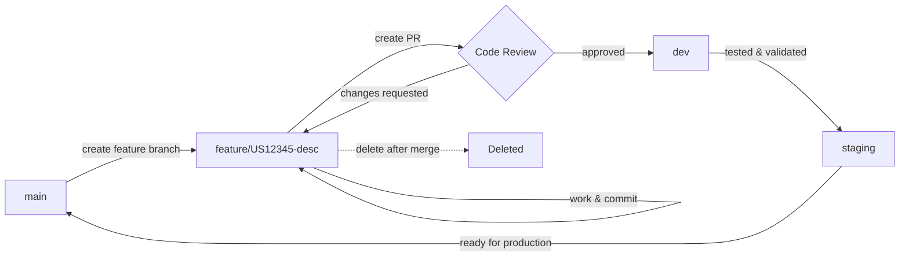

# Branch Naming Standards

This document outlines the branch naming conventions for all SNL Business repositories.

## Branch Naming Convention

All feature branches should follow this format:

```
<type>/<ticket-number>-<short-description>
```

### Branch Types

| Type | Description | Example |
|------|-------------|---------|
| `feature/` | New features or enhancements | `feature/US19407-employee-dashboard` |
| `bugfix/` or `fix/` | Bug fixes | `bugfix/TICKET-123-fix-login-error` |
| `hotfix/` | Urgent production fixes | `hotfix/PROD-456-payment-gateway` |
| `refactor/` | Code refactoring (no functional changes) | `refactor/improve-auth-performance` |
| `docs/` | Documentation updates | `docs/update-api-documentation` |
| `test/` | Test additions or updates | `test/add-unit-tests-user-service` |
| `chore/` | Maintenance tasks, dependency updates | `chore/upgrade-dependencies` |
| `release/` | Release preparation branches | `release/v2.1.0` |

## Examples

### With Ticket Numbers
```
feature/US12345-user-authentication
bugfix/BUG-456-fix-null-pointer
hotfix/PROD-789-critical-security-patch
refactor/US11111-simplify-data-model
docs/DOC-222-add-api-examples
test/US12345-add-integration-tests
chore/DEP-333-update-react-version
```

### Without Ticket Numbers
```
feature/employee-dashboard
bugfix/login-error
docs/api-updates
refactor/cleanup-auth-code
test/user-service-tests
```

## Protected Branches

These branches have special protection rules and should never be deleted:

| Branch | Purpose | Protection Rules |
|--------|---------|------------------|
| `main` | Production-ready code | ✅ Require PR<br>✅ Require approvals<br>✅ Block force push<br>✅ Require status checks |
| `dev` or `develop` | Development integration branch | ✅ Require PR<br>✅ Require approvals<br>✅ Block force push |
| `staging` | Pre-production testing (optional) | ✅ Require PR<br>✅ Block force push |
| `release/*` | Release branches | ✅ Require PR<br>✅ Block force push |

## Branch Naming Rules

1. **Use lowercase only**
   - ✅ `feature/user-auth`
   - ❌ `Feature/User-Auth`

2. **Use hyphens (-) to separate words**
   - ✅ `feature/employee-dashboard`
   - ❌ `feature/employee_dashboard`
   - ❌ `feature/employeeDashboard`

3. **Keep descriptions short and descriptive**
   - ✅ `bugfix/TICKET-123-fix-login`
   - ❌ `bugfix/TICKET-123-fix-the-login-error-that-happens-when-users-try-to-authenticate`

4. **Include ticket numbers when available**
   - ✅ `feature/US19407-employee-dashboard`
   - ⚠️ `feature/employee-dashboard` (acceptable if no ticket)

5. **No special characters except hyphens and forward slashes**
   - ✅ `feature/user-auth`
   - ❌ `feature/user@auth`
   - ❌ `feature/user auth`

## Workflow

### Creating a Branch

```bash
# From main or dev
git checkout main
git pull origin main

# Create your feature branch
git checkout -b feature/US12345-short-description
```

### Working on Your Branch

```bash
# Make your changes
git add .
git commit -m "feat: add user authentication"

# Push to remote
git push -u origin feature/US12345-short-description
```

### Creating a Pull Request

```bash
# Using GitHub CLI
gh pr create --base dev --title "Feature: Add user authentication" --body "Implements US12345"

# Or push and follow the link in terminal
git push -u origin feature/US12345-short-description
```

### After Merge

```bash
# Delete local branch
git branch -d feature/US12345-short-description

# Delete remote branch (if not auto-deleted)
git push origin --delete feature/US12345-short-description
```

## Branch Lifecycle



## Common Patterns

### Feature Development
```
main → feature/US12345-new-feature → dev → staging → main
```

### Bug Fixes
```
dev → bugfix/BUG-456-fix-issue → dev
```

### Hotfixes (Production Issues)
```
main → hotfix/PROD-789-critical-fix → main
     ↓
     dev (merge back)
```

### Release Process
```
dev → release/v2.1.0 → main
                      ↓
                      dev (merge back)
```

## Enforcement

Branch naming standards are enforced through:

1. **Code Review** - Reviewers should check branch names during PR review
2. **CI/CD Checks** - Automated checks can validate branch names
3. **Documentation** - Keep this document updated and reference in PRs
4. **Team Training** - New team members should review this guide

## Related Documentation

- [Branch Protection Setup Guide](./BRANCH_PROTECTION.md)
- [Pull Request Template](./PULL_REQUEST_TEMPLATE.md)
- [Contributing Guidelines](../CONTRIBUTING.md)
- [Code Review Guidelines](./CODE_REVIEW_GUIDELINES.md)

## Questions?

If you have questions about branch naming or need clarification, please:

1. Review this document
2. Check with your team lead
3. Ask in the #engineering Slack channel
4. Open an issue in the `.github` repository

---

**Last Updated**: November 5, 2025  
**Maintained By**: SNL Business Engineering Team
