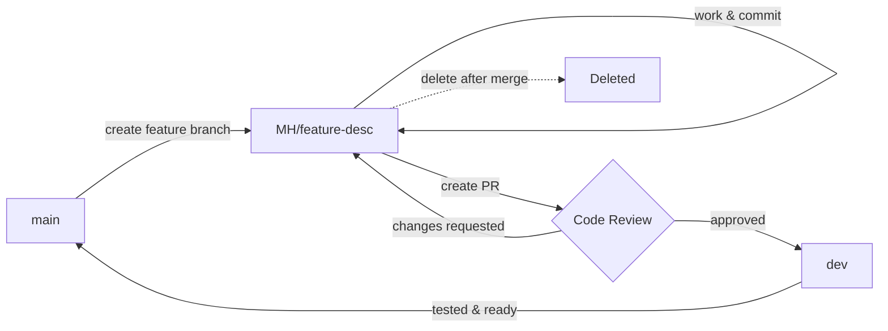

# Branch Naming Standards

This document outlines the branch naming conventions for all SNL Business repositories.

## Branch Naming Convention

All feature branches should follow this format:

```
<dev-initials>/<type>-<short-description>
```

**Example:**
```
Margaret Hamilton
MH/feature-example-of-a-description
```

### Branch Types

| Type | Description | Example |
|------|-------------|---------|
| `feature` | New features or enhancements | `MH/feature-employee-dashboard` |
| `bugfix` or `fix` | Bug fixes | `MH/bugfix-login-error` |
| `hotfix` | Urgent production fixes | `MH/hotfix-payment-gateway` |
| `refactor` | Code refactoring (no functional changes) | `MH/refactor-auth-performance` |
| `docs` | Documentation updates | `MH/docs-api-documentation` |
| `test` | Test additions or updates | `MH/test-user-service` |
| `chore` | Maintenance tasks, dependency updates | `MH/chore-upgrade-dependencies` |
| `release` | Release preparation branches | `MH/release-v2.1.0` |

## Examples

```
MH/feature-employee-dashboard
LP/bugfix-login-error
KMR/docs-api-updates
JD/refactor-cleanup-auth-code
AB/test-user-service-tests
```

## Protected Branches

These branches have special protection rules and should never be deleted:

| Branch | Purpose | Protection Rules |
|--------|---------|------------------|
| `main` | Production-ready code | ✅ Require PR<br>✅ Require approvals<br>✅ Block force push<br>✅ Require status checks |
| `dev` | Development integration branch | ✅ Require PR<br>✅ Require approvals<br>✅ Block force push |
| `release/*` | Release branches | ✅ Require PR<br>✅ Block force push |

## Branch Naming Rules

1. **Use lowercase only (except initials) **
   - ✅ `MH/feature-user-auth`
   - ❌ `MH/Feature-User-Auth`

2. **Use hyphens (-) to separate words**
   - ✅ `LP/feature-employee-dashboard`
   - ❌ `LP/feature_employee_dashboard`
   - ❌ `LP/featureEmployeeDashboard`

3. **Keep descriptions short and descriptive**
   - ✅ `KMR/bugfix-fix-login`
   - ❌ `KMR/bugfix-fix-the-login-error-that-happens-when-users-try-to-authenticate`

4. **Include your initials at the start**
   - ✅ `MH/feature-employee-dashboard`
   - ❌ `feature-employee-dashboard`

5. **No special characters except hyphens and forward slashes**
   - ✅ `JD/feature-user-auth`
   - ❌ `JD/feature@user-auth`
   - ❌ `JD/feature user-auth`

## Workflow

### Creating a Branch

```bash
# From main or dev
git checkout main
git pull origin main

# Create your feature branch (replace MH with your initials)
git checkout -b MH/feature-short-description
```

### Working on Your Branch

```bash
# Make your changes
git add .
git commit -m "feat: add user authentication"

# Push to remote
git push -u origin MH/feature-short-description
```

### Creating a Pull Request

```bash
# Using GitHub CLI
gh pr create --base dev --title "Feature: Add user authentication" --body "Description of changes"

# Or push and follow the link in terminal
git push -u origin MH/feature-short-description
```

### After Merge

```bash
# Delete local branch
git branch -d MH/feature-short-description

# Delete remote branch (if not auto-deleted)
git push origin --delete MH/feature-short-description
```

## Branch Lifecycle



## Common Patterns

### Feature Development
```
main → MH/feature-new-feature → dev → main
```

### Bug Fixes
```
dev → MH/bugfix-fix-issue → dev
```

### Hotfixes (Production Issues)
```
main → MH/hotfix-critical-fix → main
                                 ↓
                                dev (merge back)
```

### Release Process
```
dev → MH/release-v2.1.0 → main
                         ↓
                        dev (merge back)
```

## Related Documentation

- [Branch Protection Setup Guide](./BRANCH_PROTECTION.md)
- [Pull Request Template](./PULL_REQUEST_TEMPLATE.md)
- [Contributing Guidelines](../CONTRIBUTING.md)
- [Code Review Guidelines](./CODE_REVIEW_GUIDELINES.md)

## Questions?

If you have questions about branch naming or need clarification, please:

1. Review this document
2. Check with your team lead
3. Ask in the Engineering Teams channel
4. Open an issue in the `.github` repository

---

## About Our Naming Convention

Our branch naming convention honors [Margaret Hamilton](https://en.wikipedia.org/wiki/Margaret_Hamilton_(software_engineer)), the computer scientist and systems engineer who led the team that developed the onboard flight software for NASA's Apollo program. Her work was critical to the success of the Apollo 11 moon landing.

<div align="center">
  
  <p><i>Margaret Hamilton with the Apollo Guidance Computer source code she and her team developed at MIT</i></p>
</div>

By using developer initials in our branch names, we follow in the tradition of personalizing our work and taking ownership of our code—just as Margaret Hamilton did when she coined the term "software engineering" and championed rigorous testing and error handling that saved the Apollo 11 mission.

---

Made with ❤️ by the SNL Business Engineering Team

